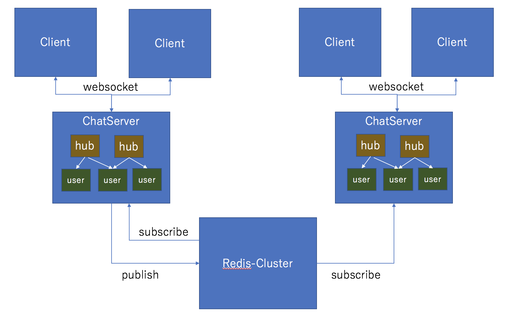

# GWRPSChat
A ChatServer made by **G**o,**W**ebSocket,**R**edis **p**ub/**s**ub  

##Structure

##Installation

just Install Go and Redis  

##Quick Start 

1.Setup redis server with 127.0.0.1:6379  
2.go run main.go  
3.Begin chat by http://localhost:8080 with web browser  

